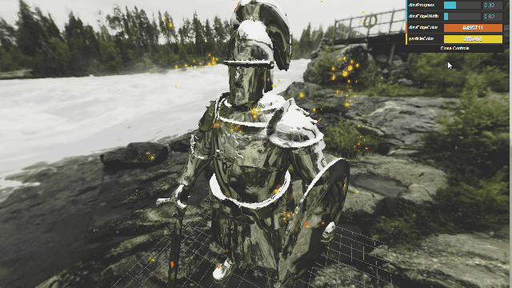

## Previews

### Dissolve fx

3D Perlin noise for dissolving pattern, Gaussian blur for outer glow.  
Inspired by [tutorial by Jatin Chopra](https://tympanus.net/codrops/2025/02/17/implementing-a-dissolve-effect-with-shaders-and-particles-in-three-js/). They used 2D Perlin noise for dissolving pattern, and three.js EffectComposer for outer glow. I switched to 3D Perlin noise because this example model is a bit more complex, and used a Gaussian blur shader for more control. I may change to use EffectComposer in the future though.

### Toon shading

Banded colors in fragment shaders, [Sobel filter](https://en.wikipedia.org/wiki/Sobel_operator) for lines, and multipass rendering for overlaying them together. Source code is not here; it is kept in a private repo.

## How to run

Using Node.js to manage dependencies and Vite for dev server, so `npm run dev` is needed to run these programs. See *package.json* for a bit more details.

## Acknowledgements

- **Fbx model**: "3D Ancient Royal Guard Model" by Drxn ([Source URL](https://sketchfab.com/3d-models/3d-ancient-royal-guard-model-d86879cf6cc8444080f3588f7993bb5a)), licensed under [CC BY 4.0](https://creativecommons.org/licenses/by/4.0/).

- **Cubemap**: "Storforsen 4" by [@_Humus_](https://x.com/_Humus_) ([Source URL](https://www.humus.name/index.php?page=Textures)), licensed under [CC BY 3.0](https://creativecommons.org/licenses/by/3.0/).

- **Perlin noise 2d**: "Simple 2d perlin noise" by SpectreSpect ([Source URL](https://www.shadertoy.com/view/DsK3W1)), licensed under [CC BY-NC-SA 3.0](https://creativecommons.org/licenses/by-nc-sa/3.0/deed.en).

- **Perlin noise 3d**: "Improved Perlin Noise 3D" by khalladay ([Source URL](https://www.shadertoy.com/view/NsfSz8)), licensed under [CC BY-NC-SA 3.0](https://creativecommons.org/licenses/by-nc-sa/3.0/deed.en).
