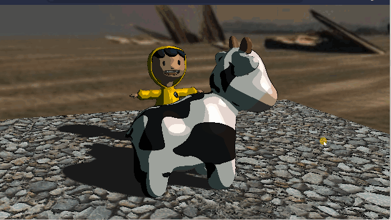

## Previews

### Toon shading

Banded colors in fragment shaders, [Sobel filter](https://en.wikipedia.org/wiki/Sobel_operator) for lines, and multipass rendering for overlaying them together. Source code is not here; it is kept in a private repo.

## Acknowledgements

- **Fbx model**: "3D Ancient Royal Guard Model" by Drxn ([Source URL](https://sketchfab.com/3d-models/3d-ancient-royal-guard-model-d86879cf6cc8444080f3588f7993bb5a)), licensed under [CC BY 4.0](https://creativecommons.org/licenses/by/4.0/).

- **Cubemap**: "Storforsen 4" by [@_Humus_](https://x.com/_Humus_) ([Source URL](https://www.humus.name/index.php?page=Textures)), licensed under [CC BY 3.0](https://creativecommons.org/licenses/by/3.0/).

- **Perlin noise 2d**: "Simple 2d perlin noise" by SpectreSpect ([Source URL](https://www.shadertoy.com/view/DsK3W1)), licensed under [CC BY-NC-SA 3.0](https://creativecommons.org/licenses/by-nc-sa/3.0/deed.en).

- **Perlin noise 3d**: "Improved Perlin Noise 3D" by khalladay ([Source URL](https://www.shadertoy.com/view/NsfSz8)), licensed under [CC BY-NC-SA 3.0](https://creativecommons.org/licenses/by-nc-sa/3.0/deed.en).
